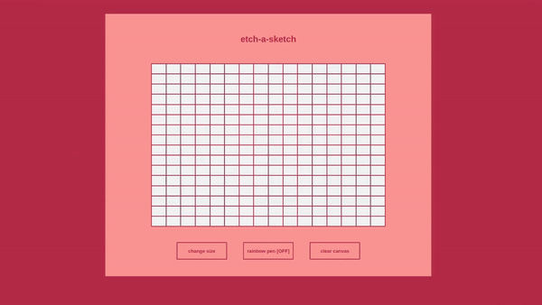

# etch-a-sketch
Etch-a-sketch grid for pixel drawings!

**Link to Project:** (https://maximilianovalle.github.io/etch-a-sketch/)

 TBA!!

## How It's Made

**Tech Used:** HTML, CSS, Javascript

TBA DESCRIPTION

## Lessons Learned:

Taking a problem step by step saves you more time in the long run than implementing everything at once. For example, when making the buttons function, I had a rough idea in my head and programmed the event listeners and functions in one go before testing them. When I did test them, surprise! They didn't work. After erasing my code and taking it one step at a time, I figured out what my initial mistake had been - I coded the event listener into a function that was never called. The mistake was so obvious that I never caught on when checking my first attempt.